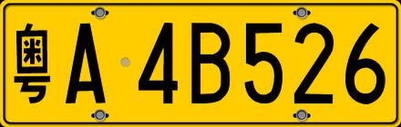

# PlateGen

自动生成中国大陆车牌图片（仅用于研究用途）。

## 用法

随机车牌号生成蓝牌车牌图片：

```python
$ python generator.py -r -t blue output
```


指定车牌号生成黄牌车牌图片（指定的车牌号码需要满足车牌要求，且字母均为大写）：

```python
$ python generator.py -T "粤A4B526" -t yellow demo
```

